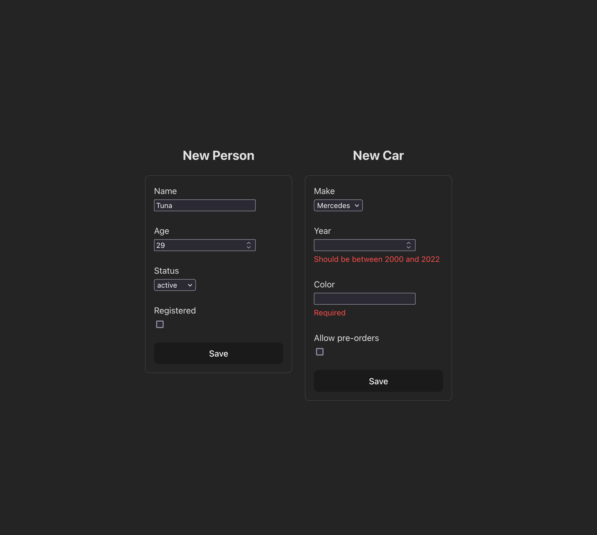

# React Challenge

What we want from you is to create a form structure with dynamic rendering and basic validations based on a configuration that you'll create.

You'll render 2 dynamic forms (check the screenshot for reference) for a person, and a car. We expect you to match the same output as much as you can.

#### Dont mind to ask anything, and please walk us through your thought process.

## Requirements

* Create a configuration structure in TS, which allows you to render different input fields dynamically.
    - Let's say the output is a person information, the application should be able to render relevant input fields for the person's name, age etc
    - The configuration should support the following types:
        * string
        * number
        * boolean
        * enum
* Create a basic validation checker.
    - The configuration should support the following validations:
        * required
        * min
        * max
* Debounce the user input
* Check if the code has any issues
* Write a test for basic functionality

#### Please mind the file and overall structure.

## Screenshots

